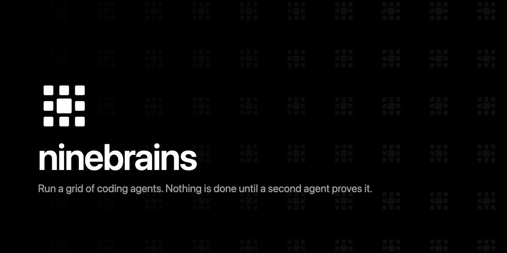
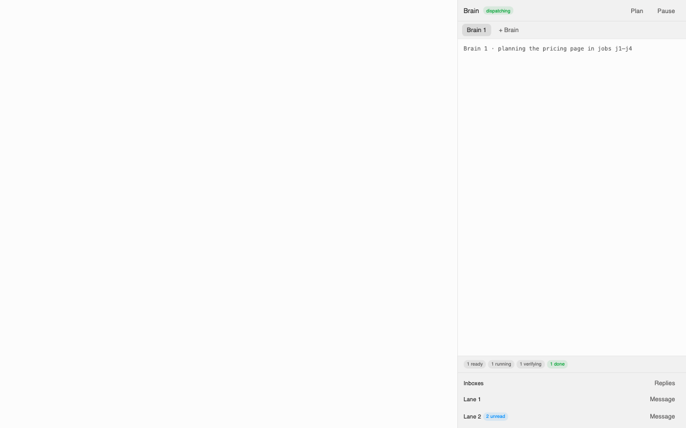
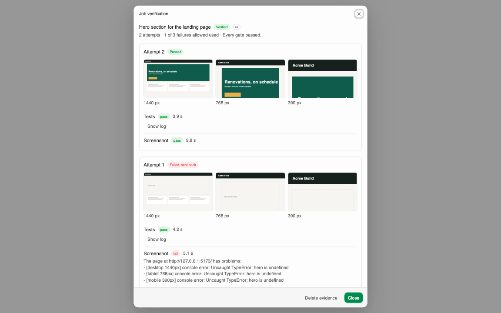
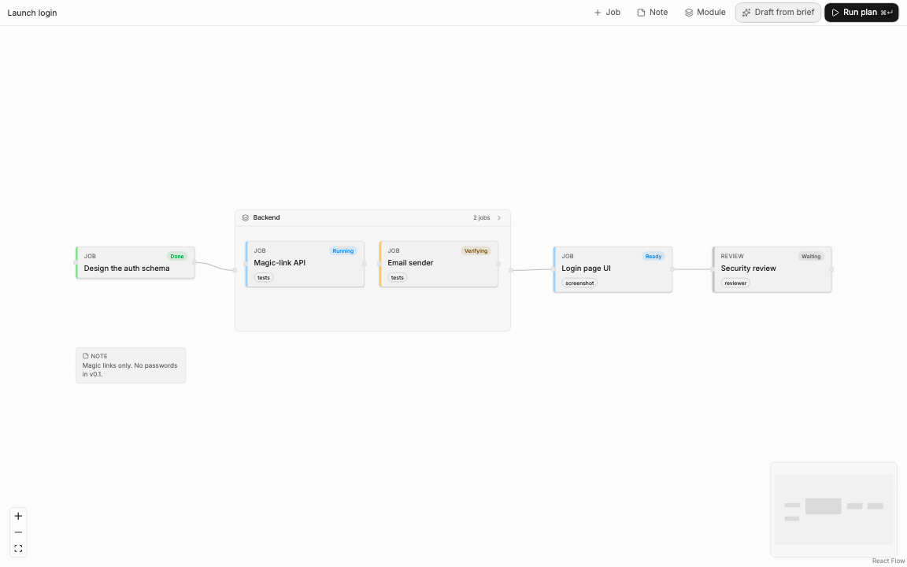
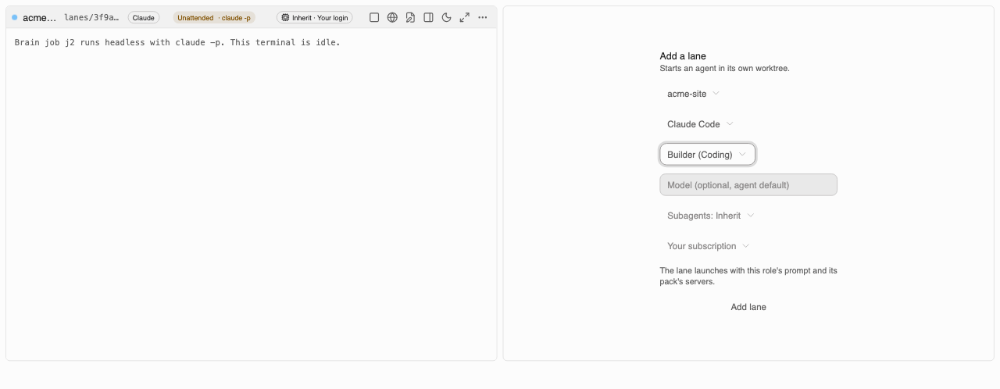

<p align="center">
  <a href="https://ninebrains.runs-on.dev"></a>
</p>

<h1 align="center">Ninebrains</h1>

<p align="center">
  <strong>Run Claude Code and OpenAI Codex agents in parallel, each in its own git worktree,<br>
  with a central Brain that hands out the work and gates that prove it before it counts as done.</strong>
</p>

<p align="center">
  Free, open-source, local-first desktop app for macOS, Windows and Linux.
</p>

<p align="center">
  <a href="LICENSE.md"></a>
  <a href="https://github.com/Advance-Labs/ninebrains/actions/workflows/ci.yml"></a>
  
  
</p>

<p align="center">
  <a href="https://ninebrains.runs-on.dev">Website</a> ·
  <a href="#quickstart">Quickstart</a> ·
  <a href="docs/guide/README.md">Documentation</a> ·
  <a href="#how-it-compares">Compare</a> ·
  <a href="#security-and-privacy">Security</a> ·
  <a href="#faq">FAQ</a>
</p>

<p align="center">
  
</p>

---

## Run four agents without losing the thread

One coding agent in one terminal is easy to follow. Four at once is not: they share a checkout,
step on each other's files, and nobody checks their claims before you read them.

Ninebrains gives every agent a **lane** of its own, then puts something in charge of the work and
something else in charge of the truth.

|  | What it does |
|---|---|
| **Lanes** | Each agent gets its own git worktree and branch, terminal, editor and browser. Four to a tab, unlimited tabs. They cannot touch each other's files. |
| **The Brain** | Holds the plan as a graph of jobs with dependencies, plus a mailbox, and hands ready jobs to whichever lane is idle. |
| **Gates** | When a lane says it is done, a second, independent run has to prove it: tests, screenshots, a read-only reviewer, citation checks. No agent grades its own work. |

The name comes from the octopus: one central brain, plus a small brain in each of its eight arms.

Ninebrains is a fork of [Emdash](https://github.com/generalaction/emdash) by General Action, so you
also get its worktrees, terminals, Monaco editor, diffs, pull requests, issue integrations, MCP
servers, skills and automations.

> **Status:** [v0.1.0](https://github.com/Advance-Labs/ninebrains/releases/latest) is out for macOS, Windows and Linux. It is an early release, and builds are not yet code-signed.

## Features

**In this build:**

- **Lanes grid.** 2×2 lanes per tab, unlimited tabs, status lights driven by the agents' own hooks,
  sleep (hide a lane; its agent keeps running), maximize, and a per-lane browser.
- **The Brain.** A drawer in the Lanes view runs a Claude Code session as the Brain, which turns a
  brief into a job graph and dispatches ready jobs to idle lanes.
- **Verification gates.** Tests, a three-width screenshot check, a read-only reviewer and citation
  checks. A failed gate sends feedback back to the lane and retries, up to three attempts, then
  blocks and tells you.
- **Rigor settings.** Two 0-10 sliders in Settings → Gates decide which gates every job gets, with
  a per-project override.
- **Planner.** A canvas where jobs are nodes and dependencies are edges. **Run plan** compiles it
  into Brain jobs, idempotently, and refuses cycles.
- **Packs.** Per-project bundles of lane roles, skills, MCP servers and gates, for coding, SEO and
  research. Every pack is off until you turn it on.
- **Lane roles and modes.** Start a lane from a pack role, and switch a lane between attended and
  unattended from its header.
- **Unattended runs.** `claude -p` and experimental `codex exec` runs, with per-run budgets, a
  sandbox, a minimal environment and a STOP switch that ends every run in under 5 seconds.
- **Nothing phones home.** Telemetry is off, with no endpoint built in. No hosted account. No
  auto-update until builds are signed. An optional **Check for new versions** setting (off by
  default) asks GitHub whether a newer release is out, and only tells you.

**Planned:** a per-lane account picker and usage meter, per-lane port leases, an overnight queue
with a morning digest, a video pack, signed builds and auto-update.

### A closer look

<table>
<tr>
<td width="50%">

**The Brain**

Type a brief into the Brain's terminal. It creates jobs, links their dependencies, and the app
dispatches ready jobs to idle lanes.



</td>
<td width="50%">

**Verification gates**

Every attempt keeps its evidence: test output, screenshots at three widths, and the reviewer's
verdict.



</td>
</tr>
<tr>
<td width="50%">

**Planner**

Draw the plan as jobs and dependency edges, then compile it into Brain jobs with **Run plan**.



</td>
<td width="50%">

**Lane roles**

Start a lane from a pack role. Its prompt, agent and model preferences fill in automatically.



</td>
</tr>
</table>

## Install

### One line

Installs Ninebrains, or updates an existing install. The script downloads the release from GitHub
and checks it against the release's `SHA256SUMS` before installing anything.

```bash
# macOS and Linux
curl --proto '=https' --tlsv1.2 -fsSL https://ninebrains.runs-on.dev/install | sh
```

```powershell
# Windows (PowerShell)
irm https://ninebrains.runs-on.dev/install.ps1 | iex
```

Read the script first if you like: open the same URL in a browser. What the checksum check does
and does not prove is in [Verify a download](docs/guide/verify-download.md#updating).

### Download

Get the latest build from [GitHub Releases](https://github.com/Advance-Labs/ninebrains/releases/latest):

| OS | File |
|---|---|
| macOS, Apple Silicon | `Ninebrains-0.1.0-mac-arm64.dmg` |
| macOS, Intel | `Ninebrains-0.1.0-mac-x64.dmg` |
| Windows | `Ninebrains-0.1.0-win-x64.exe` |
| Linux | `Ninebrains-0.1.0-linux-x86_64.AppImage` or `…-linux-amd64.deb` |

v0.1 builds are **not code-signed**. macOS Gatekeeper and Windows SmartScreen will warn you, and
unsigned builds do not auto-update. Check every download against the release's `SHA256SUMS` file
and build attestation before you open it:

```bash
shasum -a 256 -c SHA256SUMS --ignore-missing
gh attestation verify Ninebrains-0.1.0-mac-arm64.dmg --repo Advance-Labs/ninebrains
```

[docs/RELEASING.md](docs/RELEASING.md) covers Windows and Linux, and how to open an unsigned app.

### Updating

Ninebrains does not update itself. To update, run the one-line installer again, or download the new
build from [ninebrains.runs-on.dev](https://ninebrains.runs-on.dev/#download). Your projects,
settings and history stay where they are.

From 0.2.0 on, the app can tell you when a new release is out: turn on **Settings → General →
Check for new versions**, or press **Check now** there. It is off by default, because it is a
request to `api.github.com` you did not otherwise make. 0.1.0 builds have no notice; update them by
hand once.

### Build from source

You need Git and any recent `pnpm`. The repo pins pnpm 10.28.2 and Node 24.14.0, and pnpm fetches
both itself.

```bash
git clone https://github.com/Advance-Labs/ninebrains.git
cd ninebrains
pnpm install
pnpm run dev
```

To build the app instead of running the dev server, run `pnpm --dir apps/emdash-desktop build`.
[docs/FORK.md](docs/FORK.md) lists the tested toolchain and baseline.

You also need `claude` (Claude Code) and/or `codex` installed and logged in. Ninebrains starts
them; it never logs in for you.

## Quickstart

1. **Add a project.** In the sidebar, use the add button next to **Projects** and pick a local git
   repository.
2. **Open Lanes.** Press ⌘K (Ctrl+K on Windows and Linux) and run **Open Lanes**.
3. **Add lanes.** Click an empty slot, choose the project and an agent. Each lane gets its own
   worktree on a `lanes/<id>` branch. Add up to four per tab; use **+** for another tab.
4. **Set up gates.** At the default rigor, jobs need a test command. In Settings → Gates → Tests,
   pick the project, type its test command (for example `pnpm test`) and click **Save test
   command**.
5. **Give the Brain a brief.** Click **Brain** in the Lanes title bar, then **Start Brain**, and
   type the brief into its terminal. The Brain breaks it into jobs and hands them to idle lanes.
6. **Watch the gates.** When a lane finishes a job, its light turns to *verifying* while the gates
   run. A failed gate sends the lane back to work with the feedback; a passed job lands in the
   lane's Done list.

The [getting-started guide](docs/guide/getting-started.md) covers each step in detail.

## Concepts

| Term | Meaning |
|---|---|
| **Lane** | One agent (Claude Code or Codex) in its own worktree, with a terminal, editor and browser |
| **Brain** | The coordinator: a graph of jobs, a mailbox, and the dispatcher that pairs ready jobs with idle lanes |
| **Job** | One unit of work for one lane. A job is ready when every job it depends on is done |
| **Gate** | An independent check that must pass before a job counts as done: tests, screenshot, reviewer, security review, fact-check |
| **Pack** | A per-project bundle of lane roles, skills, MCP servers and default gates |

## How it compares

These are layers, not rivals. Ninebrains runs Claude Code, and it is Emdash underneath.

| | Claude Code on its own | Emdash | Ninebrains |
|---|---|---|---|
| The agent itself | Yes | Launches it | Launches it, unchanged |
| Other agent CLIs | — | Codex, OpenCode, Amp and others | Lanes: Claude Code and Codex. Other agents still work in Emdash tasks |
| Several agents on screen at once | One terminal each | Split panes within one task | 2×2 grid of lanes across worktrees, unlimited tabs |
| Shared plan with dependencies | — | — | Brain job graph and planner canvas |
| Independent check before "done" | — | — | Verification gates, three attempts, then blocked |
| Domain bundles | Your own skills and MCP config | Skills and MCP catalog | Packs: coding, SEO, research |
| Scheduled or unattended work | `claude -p` in your own scripts | Cron automations | Budgeted runs with a STOP switch |
| Telemetry | Anthropic's own settings apply | PostHog analytics | Off, no endpoint |
| Remote machines over SSH | — | Yes | Inherited for tasks; lanes are local-only |

## Security and privacy

- **Your logins stay yours.** Ninebrains launches your own logged-in `claude` and `codex` CLIs. It
  never reads, copies or stores their credentials, and never runs a login for you.
- **Telemetry is off**, and no telemetry endpoint is built in.
- **Lanes are contained.** Each launch gets its own token for the Brain, which listens on
  `127.0.0.1` only and rejects web pages. Reviewers run in a disposable, read-only checkout, and
  unattended runs get a sandbox, a minimal environment and never a permission-bypass flag.
- **The SEO pack sends data to Advance Labs when you enable it**, off by default. With its default
  address, lanes send your Google access token and search data to Advance Labs' hosted AEO Toolkit
  endpoint; self-host it and point the pack at `AEO_MCP_BASE_URL` and nothing goes to Advance Labs.
  See [Packs](docs/guide/packs.md#what-the-seo-pack-sends-and-to-whom).

Read the [security overview](docs/guide/security.md) and the full
[threat model](docs/THREAT-MODEL.md). Report vulnerabilities to **security@advancelabs.dev**, as
described in [docs/SECURITY.md](docs/SECURITY.md).

## FAQ

<details>
<summary><strong>Is Ninebrains a replacement for Claude Code?</strong></summary>

No. It launches your own `claude` and `codex` CLIs and leaves them alone. Ninebrains is the room
they work in: separate worktrees, a shared plan, and an independent check before work counts.

</details>

<details>
<summary><strong>Do I need an API key?</strong></summary>

No. Ninebrains starts the CLIs you are already logged in to, so your subscription login works as
it does in your terminal. You can point a lane at your own API key or a model server instead, in
Settings → Models, and keys are stored in your OS keychain.

</details>

<details>
<summary><strong>Does it cost extra?</strong></summary>

Ninebrains is free and open source. Usage is whatever your provider plan or key charges. The SEO
pack's hosted endpoint is free to use today; that may change if AEO Toolkit billing is switched
on, and you can self-host it.

</details>

<details>
<summary><strong>How many agents can I run at once?</strong></summary>

Four lanes per tab, and as many tabs as you want. The real ceiling is your machine and your
provider's rate limits, not the app.

</details>

<details>
<summary><strong>How is this different from running git worktrees in tmux myself?</strong></summary>

Worktrees and panes are the easy half, and Ninebrains does that for you. The other half is a plan
that knows which job depends on which, a mailbox so lanes can talk, and a gate that makes a second
agent prove the work before you read it.

</details>

<details>
<summary><strong>Can agents review each other's work?</strong></summary>

That is the point of gates. The reviewer gate runs a fresh agent with read-only tools in a
disposable checkout of the result, and it can be a different provider from the one that wrote the
code. A failed gate sends feedback back to the lane, up to three attempts, then blocks the job.

</details>

<details>
<summary><strong>What data leaves my machine?</strong></summary>

Your agents talk to Anthropic or OpenAI exactly as they would in your terminal. The app calls
GitHub for its GitHub integration and skills catalog. Pages you open in a lane browser, and URLs
the fact-check gate verifies, are fetched from the web. Packs you enable talk to their servers:
the SEO pack to Advance Labs' endpoint (unless you self-host it), and the coding pack's GitHub
server to GitHub. There is no telemetry.

</details>

<details>
<summary><strong>Does it work on Windows and Linux?</strong></summary>

Builds come from the same CI matrix for macOS, Windows and Linux. Ninebrains is developed and
tested on macOS first. On Windows and Linux, the tests gate has no OS sandbox (it relies on a
scrubbed environment, timeouts and process kills), and Windows paths are not yet tested.

</details>

<details>
<summary><strong>Can I use more than one Claude account?</strong></summary>

Yes, with one config directory per account. See [Accounts](docs/guide/accounts.md).

</details>

## Documentation

The [user guide](docs/guide/README.md) lives in `docs/guide/` and is published at
`docs.advancelabs.dev/ninebrains`.

## Contributing

See [CONTRIBUTING.md](CONTRIBUTING.md) and [architecture](docs/guide/architecture.md). Please read
the [Code of Conduct](CODE_OF_CONDUCT.md).

## Credits and licence

Ninebrains is a fork of **[Emdash](https://github.com/generalaction/emdash)** by General Action,
Inc., used under the Apache License 2.0. Emdash supplies the worktrees, terminals, editor, browser,
MCP, skills, automations and packaging that Ninebrains builds on. Ninebrains is not affiliated with
or endorsed by General Action. Every change to an inherited file is listed in
[docs/UPSTREAM-PATCHES.md](docs/UPSTREAM-PATCHES.md).

The SEO pack uses Advance Labs' [AEO Toolkit](https://github.com/Advance-Labs/aeo-toolkit)
(Apache-2.0).

Apache-2.0. See [LICENSE.md](LICENSE.md) and [NOTICE](NOTICE).
Copyright 2026 Advance Labs Inc. Portions copyright General Action, Inc.
</content>
