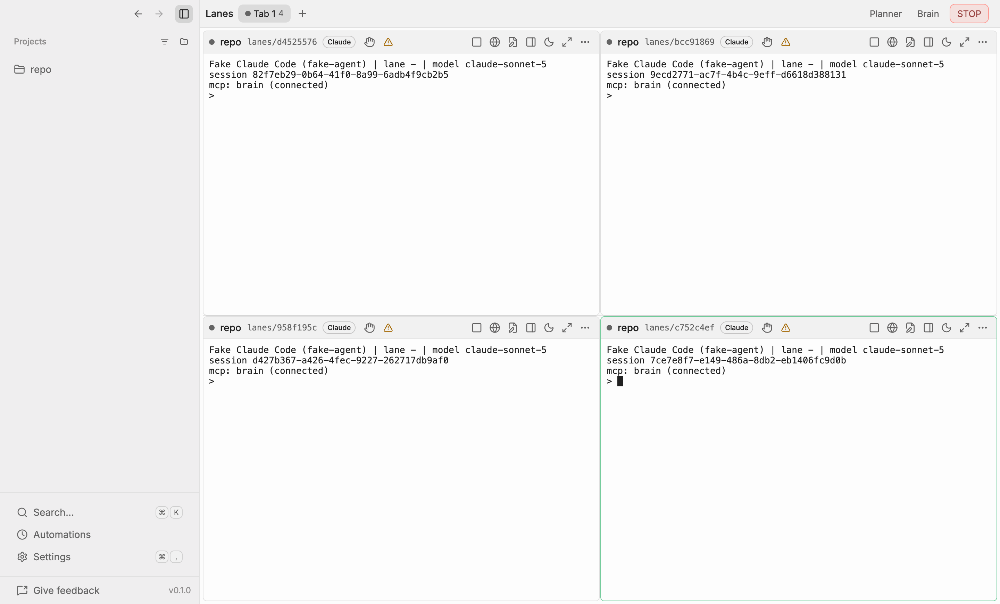

# Ninebrains

**Run a grid of Claude Code and Codex agents in parallel, each in its own git worktree, with a
central Brain that hands out the work and gates that check it before it counts as done.**



Ninebrains is a free, Apache-2.0 desktop app for macOS, Windows and Linux. It is a fork of
[Emdash](https://github.com/generalaction/emdash) by General Action.

**Status:** pre-release. v0.1 is being built now, and builds are unsigned.

## What it is, and why

One coding agent in one terminal is easy to follow. Four at once is not: they share a checkout,
step on each other's files, and nobody checks their claims before you read them.

Ninebrains gives each agent a **lane**: its own git worktree and branch, its own terminal, an
editor and a browser for its dev server. A tab shows four lanes in a 2×2 grid, and you can open as
many tabs as you like.

A central **Brain** holds the plan as a graph of **jobs** with dependencies, plus a mailbox. It
hands ready jobs to idle lanes. When a lane says it is done, **verification gates** run a second,
independent check (tests, screenshots, a read-only reviewer, citation checks) before the work
counts. No agent grades its own work.

The name comes from the octopus: one central brain, plus a small brain in each of its eight arms.

## Features

**In this build:**

- **Lanes grid.** 2×2 lanes per tab, unlimited tabs, status lights driven by the agents' own hooks,
  sleep (hide a lane; its agent keeps running), maximize, and a per-lane browser.
- **Packs.** Per-project bundles of roles, skills, MCP servers and gates, for coding, SEO and
  research. Every pack is off until you turn it on.
- **Unattended runs.** `claude -p` and experimental `codex exec` runs, with per-run budgets, a
  sandbox, a minimal environment and a STOP switch that ends every run in under 5 seconds.
- **Everything Emdash does:** worktrees, terminals, Monaco editor, diffs, pull requests, issue
  integrations, MCP servers, skills and automations.
- **Nothing phones home.** Telemetry is off, with no endpoint built in. No hosted account. No
  update feed until builds are signed.

- **The Brain.** A drawer in the Lanes view runs a Claude Code session as the Brain. You type a
  brief into it; it creates jobs and links their dependencies, and the app dispatches ready jobs to
  idle lanes.
- **Gates in the loop.** A failed gate sends feedback to the lane and retries, up to three
  attempts, then blocks and tells you. The screenshot gate captures the lane's own browser at
  three widths.
- **Rigor settings.** Two 0–10 sliders in Settings → Gates decide which gates every job gets, and
  a project can override them in Settings → Gates → Tests.
- **Planner.** A canvas where jobs are nodes and dependencies are edges, opened from the Planner
  button in the Lanes title bar. **Run plan** compiles it into Brain jobs, idempotently, and
  refuses cycles.
- **Lane roles and modes.** Start a lane from a pack role, and switch a lane between attended and
  unattended from its header.

**Planned:** a per-lane account picker and usage meter, per-lane port leases, an overnight queue
with a morning digest, a video pack, signed builds and auto-update.

## Install

### Download

Builds for macOS, Windows and Linux will be on
[GitHub Releases](https://github.com/Advance-Labs/ninebrains/releases).

v0.1 builds are **not code-signed**. macOS Gatekeeper and Windows SmartScreen will warn you.
Check every download against the release's `SHA256SUMS` file and build attestation before you open
it. [docs/RELEASING.md](docs/RELEASING.md) has the exact commands and how to get past each warning.
Unsigned builds do not auto-update.

### Build from source

You need Git and any recent `pnpm`. The repo pins pnpm 10.28.2 and Node 24.14.0, and pnpm fetches
both itself.

```bash
git clone https://github.com/Advance-Labs/ninebrains.git
cd ninebrains
pnpm install
pnpm run dev
```

To build the app instead of running the dev server, run `pnpm --dir apps/emdash-desktop build`.
[docs/FORK.md](docs/FORK.md) lists the tested toolchain and baseline.

You also need `claude` (Claude Code) and/or `codex` installed and logged in. Ninebrains starts
them; it never logs in for you.

## Quickstart

1. **Add a project.** In the sidebar, use the add button next to **Projects** and pick a local git
   repository.
2. **Open Lanes.** Press ⌘K (Ctrl+K on Windows and Linux) and run **Open Lanes**.
3. **Add lanes.** Click an empty slot, choose the project and an agent. Each lane gets its own
   worktree on a `lanes/<id>` branch. Add up to four per tab; use **+** for another tab.
4. **Set up gates.** At the default rigor, jobs need a test command. In Settings → Gates → Tests,
   pick the project, type its test command (for example `pnpm test`) and click **Save test
   command**.
5. **Give the Brain a brief.** Click **Brain** in the Lanes title bar, then **Start Brain**, and
   type the brief into the Brain's terminal. The Brain breaks it into jobs, and the app hands them
   to idle lanes.
6. **Watch the gates.** When a lane finishes a job, its light turns to *verifying* while the gates
   run. A failed gate sends the lane back to work with the feedback; a passed job lands in the
   lane's Done list.

The [getting-started guide](docs/guide/getting-started.md) covers each step in detail.

## Concepts

| Term | Meaning |
|---|---|
| **Lane** | One agent (Claude Code or Codex) in its own worktree, with a terminal, editor and browser |
| **Brain** | The coordinator: a graph of jobs, a mailbox, and the dispatcher that pairs ready jobs with idle lanes |
| **Job** | One unit of work for one lane. A job is ready when every job it depends on is done |
| **Gate** | An independent check that must pass before a job counts as done: tests, screenshot, reviewer, security review, fact-check |
| **Pack** | A per-project bundle of lane roles, skills, MCP servers and default gates |

## Security and privacy

- **Your logins stay yours.** Ninebrains launches your own logged-in `claude` and `codex` CLIs. It
  never reads, copies or stores their credentials, and never runs a login for you.
- **Telemetry is off**, and no telemetry endpoint is built in.
- **Lanes are contained.** Each launch gets its own token for the Brain, which listens on
  `127.0.0.1` only and rejects web pages. Reviewers run in a disposable, read-only checkout.
  Unattended runs get a sandbox and a minimal environment, and never a permission-bypass flag.
- **The SEO pack sends data to Advance Labs when you enable it.** It is off by default. With its
  default address, lanes send your Google access token and search data to Advance Labs' hosted AEO
  Toolkit endpoint. You can self-host that server and point the pack at it with
  `AEO_MCP_BASE_URL`, and then nothing goes to Advance Labs. See
  [Packs](docs/guide/packs.md#what-the-seo-pack-sends-and-to-whom).
- **Accepted risks** are written down, not hidden. With the provider sandbox off, a lane can read
  what your user can read.

Read the [security overview](docs/guide/security.md) and the full
[threat model](docs/THREAT-MODEL.md). Report vulnerabilities to **security@advancelabs.dev**, as
described in [docs/SECURITY.md](docs/SECURITY.md).

## How it compares

These are layers, not rivals. Ninebrains runs Claude Code, and it is Emdash underneath.

| | Claude Code on its own | Emdash | Ninebrains |
|---|---|---|---|
| The agent itself | Yes | Launches it | Launches it, unchanged |
| Other agent CLIs | — | Codex, OpenCode, Amp and others | Lanes: Claude Code and Codex. Other agents still work in Emdash tasks |
| One worktree per agent | You set it up | Yes | Yes |
| Several agents on screen at once | One terminal each | Split panes within one task | 2×2 grid of lanes across worktrees, unlimited tabs |
| Shared plan with dependencies | — | — | Brain job graph and planner canvas |
| Messages between agents | — | — | Brain mailbox |
| Independent check before "done" | — | — | Verification gates, three attempts, then blocked |
| Domain bundles | Your own skills and MCP config | Skills and MCP catalog | Packs: coding, SEO, research |
| Scheduled or unattended work | `claude -p` in your own scripts | Cron automations | Budgeted runs with a STOP switch |
| Telemetry | Anthropic's own settings apply | PostHog analytics | Off, no endpoint |
| Remote machines over SSH | — | Yes | Inherited for tasks; lanes are local-only |

## FAQ

**Does it cost extra?**
Ninebrains is free and open source. It runs your own `claude` and `codex` CLIs under your own
login or API key, so usage is whatever your provider plan or key charges. Ninebrains makes no claim
about which quota or billing its runs draw from. The SEO pack's hosted endpoint is free to use
today; that may change if AEO Toolkit billing is switched on, and you can self-host it.

**What data leaves my machine?**
Your agents talk to Anthropic or OpenAI exactly as they would in your terminal. The app calls
GitHub for its GitHub integration and skills catalog. Pages you open in a lane browser, and URLs
the fact-check gate verifies, are fetched from the web. Packs you enable talk to their servers:
the SEO pack to Advance Labs' endpoint (unless you self-host it), and the coding pack's GitHub
server to GitHub. There is no telemetry.

**Windows and Linux?**
Builds come from the same CI matrix for macOS, Windows and Linux. Ninebrains is developed and
tested on macOS first. On Windows and Linux, the tests gate has no OS sandbox (it relies on a
scrubbed environment, timeouts and process kills), and Windows paths are not yet tested.

**Can I use more than one Claude account?**
Yes, with one config directory per account. See [Accounts](docs/guide/accounts.md).

## Documentation

The [user guide](docs/guide/README.md) lives in `docs/guide/` and is published at
`docs.advancelabs.dev/ninebrains`. Contributors: [CONTRIBUTING.md](CONTRIBUTING.md) and
[architecture](docs/guide/architecture.md).

## Credits and licence

Ninebrains is a fork of **[Emdash](https://github.com/generalaction/emdash)** by General Action,
Inc., used under the Apache License 2.0. Emdash supplies the worktrees, terminals, editor, browser,
MCP, skills, automations and packaging that Ninebrains builds on. Ninebrains is not affiliated with
or endorsed by General Action. Every change to an inherited file is listed in
[docs/UPSTREAM-PATCHES.md](docs/UPSTREAM-PATCHES.md).

The SEO pack uses Advance Labs' [AEO Toolkit](https://github.com/Advance-Labs/aeo-toolkit)
(Apache-2.0).

Apache-2.0. See [LICENSE.md](LICENSE.md) and [NOTICE](NOTICE).
Copyright 2026 Advance Labs Inc. Portions copyright General Action, Inc.

Please read the [Code of Conduct](CODE_OF_CONDUCT.md).
