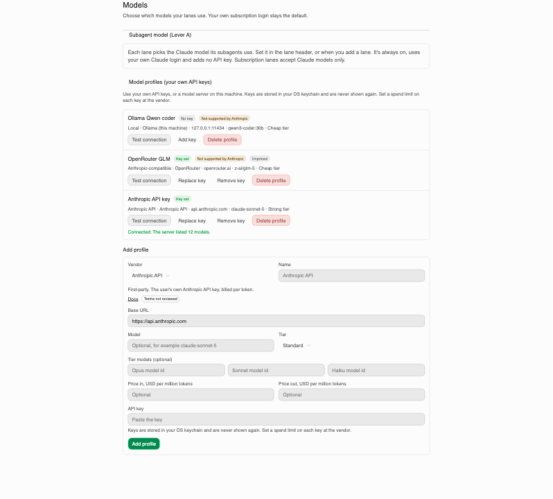
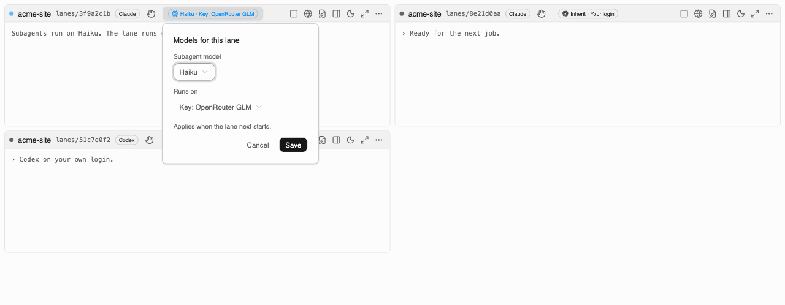

Routing picks which model does the work for a lane or its subagents. There are two separate
levers. Lever A is always on and stays on your own Claude login. Lever B is optional, needs your
own API key, and may not be visible in your build yet.

## Lever A: subagent model

Every lane has a subagent model. It sets `CLAUDE_CODE_SUBAGENT_MODEL` for the lane's `claude`
process, which picks the model every subagent, agent team and workflow agent in that lane uses.

- It stays on your own Claude login. No gateway, no API key, no base URL.
- Only Claude models are allowed: `inherit`, `haiku`, `sonnet`, `opus`, `fable`, or a full
  `claude-*` model id. A non-Claude id is refused.
- `inherit` sets nothing. Each subagent then uses its own frontmatter model, or the lane's main
  model.
- A lane can set its own subagent model, or leave it to the pack role's default. The lane's own
  choice wins.
- It applies the next time the lane starts, not to a session already running.
- Codex has no equivalent setting. Codex lanes show no subagent-model control.

Set it in the lane header's model badge, or when you add a lane.

## Lever B: model profiles (Settings → Models)

Lever B lets a lane run on your own API key instead of your subscription login. It lives behind a
build flag and is **off in release builds until a decision is made**. If you don't see a Model
profiles section in Settings → Models, this build has it off.

### Profile kinds

A profile has a kind, which decides how Ninebrains talks to it:

| Kind | What it is |
|---|---|
| `anthropic-api` | Anthropic's own API, with your key |
| `openai-api` | OpenAI's own API, with your key, for Codex |
| `anthropic-compatible` | A vendor that speaks Claude Code's `/v1/messages` protocol |
| `openai-responses-compatible` | A vendor that speaks Codex's `/v1/responses` protocol |
| `local` | A model server on this machine, either protocol |

`bedrock`, `vertex` and `foundry` are not in this version.

### The vendor list

A profile's base URL must be on Ninebrains' reviewed vendor list, or be a loopback address for a
local profile. The current list: Anthropic and OpenAI as first-party APIs, OpenRouter and
Fireworks as reviewed remote vendors, and Ollama and LM Studio as local presets. Any other host is
refused when you save the profile.

### Keys stay write-only

You paste a key once. Ninebrains stores it in your OS keychain as `ninebrains.model.<id>` and never
shows it again, not even to you. The Settings page can set, replace, test and delete a key, never
read one back.

### Test connection

The Test connection button makes one GET request for the vendor's model list, using your key. It
does not run a model, and it does not follow redirects: if the vendor redirects, use the final URL
as your base URL instead.

### Choosing a profile for a lane

The lane header's "Runs on" control (and the same field on the add-lane form) lists "Your
subscription" plus every enabled profile that matches the lane's agent (Claude profiles for Claude
lanes, Codex profiles for Codex lanes).

What each gets:

- **A Claude lane on a profile** gets `ANTHROPIC_BASE_URL`, an auth token or key, and the
  profile's model mapped onto the `ANTHROPIC_DEFAULT_*_MODEL` aliases.
- **A Codex lane on a profile** gets a `nb` model provider added to its launch (`base_url`,
  `wire_api=responses`), with the key passed in the `NB_MODEL_KEY` environment variable.

Profile routing applies to attended lanes and to unattended runs alike.

### "Not supported by Anthropic"

Anthropic's own words: it doesn't support routing Claude Code to non-Claude models through any
gateway. When a Claude-protocol profile points at a host other than `api.anthropic.com`, Ninebrains
shows a "Not supported by Anthropic" badge. The profile can still work, but Anthropic doesn't
maintain or audit it, and some features may not work.

### Reviewer model (optional pin)

By default, every reviewer run — the `reviewer` and `security-review` gates — stays on your
subscription, whichever agent did the work. Settings → Models has a **Reviewer model** picker, next
to the profile list, that lets you pin reviewers to one model profile instead.

Once you pin a reviewer profile, it is never silently downgraded (SEC-42): if the pinned profile is
missing, disabled, has no key, or is unhealthy, the review is **blocked**, not passed and not
retried on your subscription or a cheaper tier. Clear the picker to go back to the subscription
default.

The picker is part of Lever B, so it only appears in builds where model profiles are on; it is
hidden and ignored in release builds, where reviewers always run on the subscription.

## SEC-39, in plain words

A lane on your subscription never gets a gateway URL, token or key. Ninebrains blanks
`ANTHROPIC_BASE_URL`, `ANTHROPIC_AUTH_TOKEN` and `ANTHROPIC_API_KEY` for that launch, even if your
shell or your own Claude settings files set them. The one exception is the subagent model, which
must still be a Claude model.

If enterprise-managed Claude settings set a gateway variable, Ninebrains refuses to launch instead
of guessing. Managed settings outrank everything Ninebrains writes, so there's no safe way to
override them.

## The run-start check (SEC-41)

For unattended Claude runs, Ninebrains reads the CLI's own report of which credential and which
model it's using, at the start of the run. If that doesn't match what the lane should be running
on, the run is stopped immediately, before it does any work.

There's a wrinkle: a gateway token (`ANTHROPIC_AUTH_TOKEN`) reports the same credential source as a
subscription login. Ninebrains can't tell them apart from that field alone, so the model in use
does that part of the check instead.

Codex has no equivalent signal in its run output. The provider it used can only be read after the
fact, from its session file.

## Your key lives in the lane's environment

A profile's key sits in the environment of the process it launches. That means any tool the lane's
agent runs — a shell command, for example — can read it. This is an accepted risk (R19). Set a
spend limit on every key at the vendor, so a leaked or misused key has a ceiling.

## Not in this version

These are wave 2 work, not built yet:

- Costs and budgets in dollars.
- Fallback to another model or vendor when one fails.

## Troubleshooting

| Message | What it means |
|---|---|
| "profile has no API key" | Add a key in Settings → Models before using this profile. |
| "not on the vendor list" | The base URL's host isn't reviewed. Pick a listed vendor, or a loopback address for a local server. |
| "managed settings set ANTHROPIC_BASE_URL" | Enterprise-managed Claude settings already point at a gateway. Ninebrains won't launch until that's removed, since managed settings outrank the app. |
| "a subscription lane's subagents must use a Claude model" | The lane is on your login, so its subagent model must be `inherit`, a tier alias, or a `claude-*` id. |
| A run ends on "credential mismatch" | The run-start check (SEC-41) saw a different credential or model than expected, and stopped the run before it did any work. |
