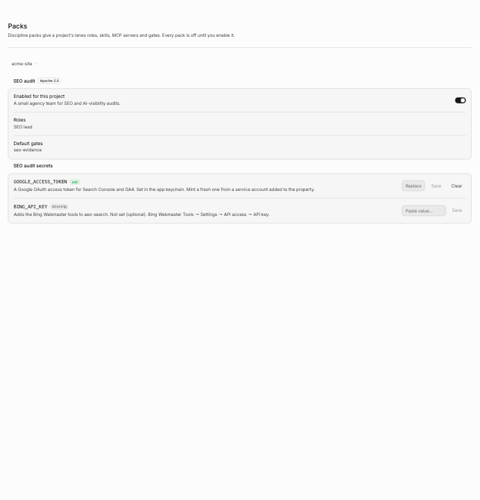

A **discipline pack** is a per-project bundle of four things:

- **Roles.** A role is a lane preset: a system prompt, an optional provider and model, and default
  gates.
- **Skills**, installed through the skills manager Ninebrains inherits from Emdash.
- **MCP servers** for the lanes to use.
- **Gates** that the pack's work must pass.

**Every pack is off until you turn it on for a project**, in **Settings → Packs**. A project that
has not enabled a pack gets nothing from it.

## Bundled packs

| Pack | Roles | MCP servers | Gates |
|---|---|---|---|
| `coding` | builder, ui-builder, reviewer | GitHub (hosted), Supabase, Cloudflare, all optional. Vercel is listed as an OAuth catalog link | `tests`, `reviewer`; ui-builder adds `screenshot` |
| `seo` | seo-lead, technical-seo, content-strategist, link-researcher, search-analyst, fact-checker | `aeo-search`, `aeo-visibility`, `aeo-backlink` (hosted), DataForSEO (optional) | `seo-evidence`; the lead adds `reviewer` |
| `research` | research-lead, researcher, fact-checker | none | `fact-check`, `reviewer` |

A video pack is planned for a later release. It is not built.

All role prompts were written for this project. Every MCP server and skill a pack names must carry
an MIT, Apache-2.0, ISC, BSD-2/3-Clause or 0BSD licence; the loader rejects anything else.

## How a pack reaches a lane

When a lane launches in a project, Ninebrains writes that launch's MCP config. It contains the
Brain's server plus the servers of every pack the project has enabled, and nothing from other
projects. If you picked a role when you [added the lane](lanes.md#adding-a-lane), the role's
prompt is appended to the agent's system prompt, for attended Claude lanes and for unattended
runs.

A role's gates are **not yet** applied to the jobs its lane works on. A job's gates come from
whoever created the job and from your rigor settings. Codex lanes don't receive the role prompt
yet either: Codex has no flag to append to its system prompt.

A server that needs a secret you have not provided is **left out with a warning**. It is never
launched half-configured, and warnings never contain secret values.

### Skills

Pack skills install as `nb-<pack>-<skill>` into the global skills folder (`~/.agentskills`). Two
consequences:

- Skills are global, so a pack's skills are visible to agents in other projects too, including
  agents you run outside Ninebrains. This is an accepted limitation for v0.1.
- **The `nb-` prefix is reserved.** Skill sync removes any `nb-*` skill it does not want, and
  removes a pack's skills once no project has the pack enabled.

## Secrets

A pack file names its secrets; it never contains them. Nothing is stored in the pack file or in
your preferences.

Set them in **Settings → Packs**. Under each pack, a secrets section lists every secret its servers
need, marked **set** or **missing**, with where to get it. Paste a value and press **Save**:

- The value goes into the OS keychain through Electron `safeStorage`, under
  `ninebrains.pack.<NAME>`. If the OS offers no encryption (or Linux is on the `basic_text`
  backend), saving fails and says so. It never falls back to plaintext.
- **It is write-only.** The field empties after saving, and the app never sends a stored value
  back to the window, so there is nothing to reveal. Errors and logs name the secret, never its
  value.
- **Clear** removes a value you stored here.
- Only secrets that a loaded pack declares can be set.

A value in the environment variable `NINEBRAINS_SECRET_<NAME>` (for example
`NINEBRAINS_SECRET_GOOGLE_ACCESS_TOKEN`) still works, and the page marks it as set outside the app.
The keychain value wins when both exist. New values reach a lane at its next launch.

## SEO pack

Six roles mirror a small agency team. The pack uses the three MCP servers from Advance Labs'
Apache-2.0 [AEO Toolkit](https://github.com/Advance-Labs/aeo-toolkit): search data from Google
Search Console, GA4 and Bing (19 tools), AI-visibility checks (5 tools) and backlink research (7
tools). It bundles three skills from the same repo: `seo-cannibalization`, `seo-content-decay` and
`seo-traffic-drop`.

The SEO lead writes its report as `seo-report.md`.

### The `seo-evidence` gate

The SEO team writes its findings to `seo-findings.json`. Every finding needs at least one piece of
evidence: a **query** (server, tool, exact arguments, and the numbers cited), a **crawl** (URL and
observation) or a **citation** (URL and exact quote). The gate then:

1. runs a reviewer in a disposable, read-only checkout, never in the lane's worktree;
2. fetches every cited page itself, through an SSRF-safe fetcher (up to 20 pages);
3. checks citation quotes against the page text, which is a deterministic check: a quote that is
   not on its page fails the finding whatever the reviewer says;
4. has the reviewer re-run each cited query on the pack's servers and mark each finding
   `confirmed`, `contradicted` or `unverifiable`.

The gate fails on any contradicted finding, or when more than 20% are unverifiable. If the reviewer
cannot use a cited server, the gate fails and says so. It never passes unchecked work.

> **Hand-check the first audits before you send them to anyone.** The gate checks that the cited
> numbers match the data. It does not check that the data is the right data. The AEO Toolkit's
> scoring engine had accuracy bugs that were fixed in aeo-toolkit PR #34.

### What the SEO pack sends, and to whom

With the SEO pack enabled and the default server address
(`AEO_MCP_BASE_URL = https://aeo.advancelabs.dev/api/mcp`), lanes and the evidence reviewer call
**Advance Labs' hosted AEO Toolkit endpoint**. They send it:

- your **Google access token**, as the `Authorization` header;
- your Bing Webmaster key, if you set one;
- any Perplexity key a lane passes to the visibility tools;
- the queries, URLs and site data the tools work on.

The endpoint's code handles tokens per request, and its route documentation says it does not store
them. You are still trusting that deployment. While the default address is in use, the settings
page shows this notice, and enabling the pack takes an explicit confirmation step ("Enable and send
this data").

The hosted endpoint is open to use today. It checks an entitlement that will require a plan with
MCP access if AEO Toolkit billing is switched on.

Google access tokens expire after about an hour, so whatever supplies the token has to refresh it.

### Self-hosting the SEO servers

The three servers are Apache-2.0 in
[`Advance-Labs/aeo-toolkit`](https://github.com/Advance-Labs/aeo-toolkit), in `apps/console`, under
the routes `/api/mcp/<slug>/mcp`. Its `docs/DEPLOYMENT.md` covers deploying them.

1. Deploy the console yourself.
2. Set `AEO_MCP_BASE_URL` to your base, for example `https://seo.example.com/api/mcp` or
   `http://localhost:3000/api/mcp`. It is read the same way as a secret, so with the environment
   resolver that is `NINEBRAINS_SECRET_AEO_MCP_BASE_URL`.

Then no SEO data goes to Advance Labs. At launch the address is checked again: anything other than
`https`, or `http` on localhost, leaves the servers out with a warning.

## Coding pack

The coding pack's servers are all optional. GitHub uses GitHub's hosted MCP endpoint with your
personal access token as a bearer header, so enabling it sends that token to GitHub. Supabase and
Cloudflare run as local processes. Vercel is offered as a catalog link that uses Vercel's own OAuth
sign-in.

## Research pack

The research pack has no MCP servers. Researchers write `claims.json` with a source URL and an
exact quote for every claim, and the `fact-check` gate checks each one. See
[Verification gates](gates.md#fact-check).

## Writing your own pack

The loader reads bundled packs first, then `<userData>/ninebrains/packs/<id>/pack.json`. The
directory name must equal the pack's `id`, and it may not reuse a bundled id. Files are read with a
realpath check, so a symlink cannot reach outside the pack directory.

A pack's MCP servers run with your user's permissions, like any other program you install. Treat a
pack from someone else the way you would treat their code.

The full `pack.json` schema, with every field, is in the
[packs feature README](../../apps/emdash-desktop/src/core/features/packs/README.md).
