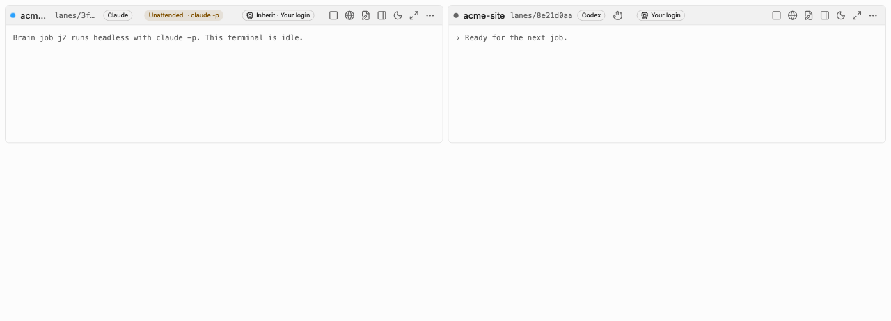

A lane you watch is **attended**: the agent's normal interactive interface runs in a terminal, and
it asks you before doing anything risky. An **unattended** run has no terminal and no one to ask.
Ninebrains starts the CLI in print mode and reads its event stream:

- Claude Code: `claude -p --output-format=stream-json`.
- Codex: `codex exec --json`. Codex support for unattended runs is **experimental**.

Unattended runs carry out the reviewer side of verification gates. They can also carry out
Brain-dispatched work, for a lane set to unattended mode. In this build, both use Claude Code.

Lanes are attended by default. A lane's mode is saved with the lane, so it survives a restart.

## Making a lane unattended

Every lane starts **attended**: the Brain pastes each job into the lane's terminal, where you can
watch it and answer its prompts. To hand a lane's Brain jobs to headless runs instead, click the
hand icon in the lane's header and confirm. The dialog says which command runs and with which
budgets before anything changes.

An unattended lane shows a warning badge in its header, **Unattended · claude -p** (or
`codex exec`), so you never mistake it for a lane you are watching. Hover it to see the budgets;
click it to switch back to attended straight away. Only jobs the Brain dispatches run headless.
Anything you type into the lane's terminal yourself is unaffected.

The mode is saved with the lane, so an unattended lane stays unattended after a restart.

Unattended runs use whatever login or API key your CLI uses. Ninebrains makes no claim about which
plan, quota or billing they draw from. Check your provider's terms.

## Budgets

The run supervisor in the app's main process enforces the limits, not the agent. Each run can
carry:

| Limit | How it is enforced |
|---|---|
| Wall clock | The supervisor ends the run when time is up |
| Turns | `--max-turns` |
| Spend | `--max-budget-usd` (Claude) |
| Tokens | Counted from the stream's `usage` events: input, output, cache-creation and cache-read tokens |
| Concurrent runs | A global cap of 4. A run over the cap is refused, not queued; queueing is the dispatcher's job |

While a run is live, the supervisor writes its budget counters into the run's own transcript. If
the app restarts, it reads them back from there, so a restart does not reset them. A run that was
still open when the app stopped is marked as killed.

## The STOP switch

STOP ends every run the Brain owns:

1. New dispatch is blocked straight away.
2. Every run's process group gets SIGTERM.
3. After 2 seconds, anything still alive gets SIGKILL.

It also stops the terminal session of every attended lane that holds a Brain job.

A test runs eight runs whose processes and child processes ignore SIGTERM, and checks that all are
gone in under 5 seconds.

STOP is in four places:

- the **Agents** menu in the app menu bar (**Stop All Agent Work**),
- the tray icon's menu, when the tray icon is on,
- the keyboard shortcut **⌘⇧⌫** (Ctrl+Shift+Backspace on Windows and Linux), which is also the Agents
  menu item's shortcut and works even while a terminal has focus,
- the **STOP** button in the Lanes view.

The Agents menu and the tray menu call the Brain in the app's main process, not through the window,
so they work even if the window has frozen. STOP also stops the terminal sessions of lanes that are
working on a Brain-dispatched job. Lanes you drive by hand keep running.

STOP stays **latched**: nothing new is dispatched and no run starts until you clear it. Use
**Clear STOP** in the Agents menu, the tray menu or the Brain drawer; it is only offered while STOP
is latched. The latch is held in memory, so quitting and reopening the app also clears it.

Known limits:

- A process that calls `setsid()` leaves its process group and survives STOP.
- On Windows, STOP uses `taskkill /T`, which reaches only the process tree.

## Where a run may work

- **Folder.** A run's working directory must sit inside an allowed root, which is the project's
  worktree root or the review-checkout root. Symlinks that lead outside are refused. There is no
  fallback to another directory: if the check fails, the run does not start.
- **Sandbox (Claude).** Each run gets its own settings file that turns on the Claude Code sandbox
  and fails if the sandbox is unavailable. The run can write only its own worktree. Reads of
  Ninebrains' data folder, other lanes' worktrees, `~/.ssh`, `~/.aws`, `~/.config/gcloud`,
  `~/.config/gh`, `~/.codex`, provider credential files, `~/.netrc`, `~/.npmrc` and a few others
  are denied.
- **Sandbox (Codex).** `--sandbox workspace-write` with approvals set to never. Codex's sandbox
  limits writes, not reads, so a Codex run can read other lanes' files.
- **MCP servers.** Only the servers in the run's own config (`--strict-mcp-config`).
- **Environment.** A narrow allowlist: provider login variables (`CLAUDE_CONFIG_DIR`, `CODEX_HOME`,
  and `ANTHROPIC_API_KEY` only if you chose API-key mode), `PATH`, `HOME`, `TMPDIR`, locale and
  proxy variables. `GITHUB_TOKEN`, `GH_TOKEN`, `AWS_*`, `GOOGLE_APPLICATION_CREDENTIALS` and
  third-party model keys are dropped.
- **Transcripts** pass through a redactor that removes common key and token formats before they are
  written. They are stored under `ninebrains/runs/` in the app data folder. See
  [Configuration](configuration.md#file-locations).

## What never runs automatically

- **Permission bypasses.** No launch builder may produce `--dangerously-skip-permissions`,
  `--permission-mode bypassPermissions`, or Codex's `--dangerously-bypass-approvals-and-sandbox` or
  `--sandbox danger-full-access`. A guard inside the spawn wrapper throws if one appears.
- **Outbound actions.** Deploys, DNS changes, payments, email, `git push`, package publishing and
  cloud CLIs are denied by absence: an unattended run has no credentials for them.
- **Prompt text as flags.** The job text reaches the CLI on stdin, never as a command-line
  argument, so a job that starts with `--` cannot turn into a flag.
- **Programs planted in the worktree.** The CLI is started from an absolute path found by the app,
  never from the worktree or its `node_modules/.bin`.
- **Test commands from the work itself.** The tests gate runs only the command you set for the
  project, never one taken from a job or from a file in the worktree.
- **A reviewer that can change things.** Reviewers get Read, Grep and Glob only: no shell, no
  writes, no network.

## Not built yet

- A way for a plan to request outbound capabilities, with your approval recorded. In this build,
  nothing can grant an unattended run those capabilities.
- An overnight queue runner with a morning digest.
- An append-only security event log in the Brain database.

## Known gaps

- The tests gate runs in an OS sandbox on macOS (`sandbox-exec`, which Apple has deprecated) and
  on Linux when bubblewrap (`bwrap`) is installed. Both allow network to localhost only. On Windows,
  and on Linux without bubblewrap, the tests gate refuses to run. See
  [Troubleshooting](troubleshooting.md#the-tests-gate-says-it-needs-a-sandbox).
- Windows paths are untested.
- The unattended path has been tested against `tooling/fake-agent`, a stand-in CLI. It has not yet
  been exercised against the real `claude` or `codex` CLIs in this form.
