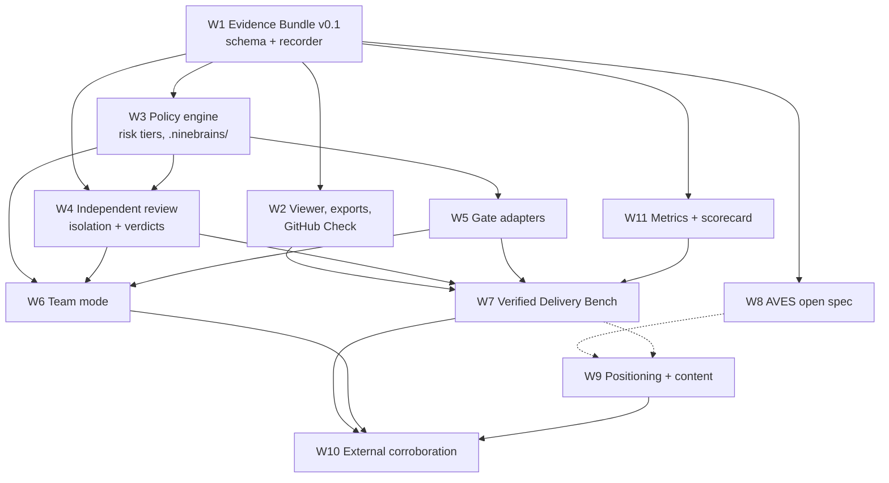

# Execution plan

Five waves over roughly 90 days. Waves are dependency boundaries, not calendar boxes: a
wave opens when its inputs exist, not when a date arrives.

## Dependency graph

Solid edges are hard: a job does not start until its input exists. The two dashed edges into
W9 are **partial**: they gate only the pages that cite a benchmark result or the published
spec (`/benchmarks/verified-delivery/`, `/evidence-bundles/`). W9's Wave 1 jobs — the
homepage, the category page, the limitations page, entity consolidation — have no upstream
dependency and are dispatched immediately. Without that distinction the DAG and the wave
table contradict each other.

Read the critical path as: **W1 → W4 → W7 → W10**. Everything credible downstream depends
on the bundle being right and the reviewer being genuinely independent. Slipping W1 slips
the benchmark, and slipping the benchmark slips every external-validation claim.

## Wave 1 — foundations (days 1–20)

Nothing here is user-visible except messaging. It is the contract layer everything else is
built on.

| Job | Workstream | Lane | Model | Blocks |
|---|---|---|---|---|
| Evidence Bundle v0.1 JSON schema | W1 | L1 | Opus | W2, W4, W8, W11 |
| Bundle recorder: provenance, commands, exit codes, attempts | W1 | L1 | Opus | W2 |
| Four terminal states: `verified`, `verified-with-waiver`, `blocked`, `inconclusive` | W1+W3 | L1+L2 | Opus | W3, W6 |
| Risk-tier model and `.ninebrains/` policy file format | W3 | L2 | Opus | W4, W5, W6 |
| Homepage and category messaging rewrite | W9 | L8 | Opus | — |
| Limitations page: what gates do and do not prove | W9 | L8 | Opus | W10 |
| Early-release and unsigned-build status made impossible to miss | W9 | L8 | Sonnet | — |
| Entity/metadata consolidation across repo, site, package metadata | W9 | L8 | Sonnet | W10 |

**Wave 1 exit criterion.** A job run locally produces a bundle that validates against the
published schema, records base and final commit, agent, model, harness version, every
command with its exit code, and every failed attempt — and the app shows one of the four
terminal states rather than a boolean.

## Wave 2 — the verification loop (days 15–45)

| Job | Workstream | Lane | Model |
|---|---|---|---|
| HTML export and permanent local evidence viewer | W2 | L1 | Sonnet |
| JSON export against the published schema | W2 | L1 | Sonnet |
| Model/provider separation rules for reviewers | W4 | L3 | Opus |
| Reviewer identity, permissions, and verdict recorded in the bundle | W4 | L3 | Opus |
| Deterministic adapters: tests, typecheck, lint, build, coverage delta | W5 | L4 | Sonnet |
| Security adapters: secret scan, dependency audit, SAST | W5 | L4 | Sonnet |
| Risk tiers wired to gate selection, replacing raw rigor sliders | W3 | L2 | Opus |
| Opt-in local metrics export, no telemetry contradiction | W11 | L10 | Sonnet |
| AVES draft 0.1 published for comment | W8 | L7 | Opus |
| Design-partner recruitment brief and first partner conversations (pulled forward from Wave 3) | W10 | L9 | Sonnet |
| Comparison pages: Superset, Pane, Cursor, manual worktrees | W9 | L8 | Opus |

**Wave 2 exit criterion.** A standard-tier job cannot reach `verified` unless deterministic
gates pass *and* a reviewer running a different provider, in a disposable detached
checkout, with read-only tools, returns a recorded verdict.

## Wave 3 — team surface and first proof (days 30–70)

| Job | Workstream | Lane | Model |
|---|---|---|---|
| GitHub Check and PR evidence integration | W2 | L1 | Sonnet |
| Behavioral adapters: Playwright journeys, contract tests, a11y, visual diff | W5 | L4 | Sonnet |
| Stale-base detection and combined-branch verification | W5 | L4 | Opus |
| Version-controlled shared policy, named waivers, approvals, audit log | W6 | L5 | Sonnet |
| Team templates: Next.js/Supabase, React/Vite, Node API, Python service, monorepo | W6 | L5 | Sonnet |
| Verified Delivery Bench methodology and first task set | W7 | L6 | Opus |
| Continue partner recruitment (started in Wave 2, see the sequencing mitigation) | W10 | L9 | Sonnet |
| Three demo repositories with intentionally failing first attempts | W10 | L9 | Sonnet |

**Wave 3 exit criterion.** A five-person team can clone a repository and inherit the same
agent workflow and quality bar without reading a private setup document.

## Wave 4 — measured evidence (days 55–85)

| Job | Workstream | Lane | Model |
|---|---|---|---|
| Bench harness: pinned commits, container images, three repetitions minimum | W7 | L6 | Opus |
| Judging code and false-verification detection | W7 | L6 | Opus |
| Publish raw trajectories, patches, bundles, costs, retries, review minutes | W7 | L6 | Sonnet |
| Two external engineers review the benchmark design | W7 | L6 | — (human) |
| Publish failures, false positives, inconclusive runs | W7 | L6 | Opus |
| Scorecard dashboards for product and recommendation metrics | W11 | L10 | Sonnet |
| AVES 1.0 with conformance tests | W8 | L7 | Opus |
| Benchmark results page, guides, changelog, security/threat-model pages | W9 | L8 | Sonnet |

**Wave 4 exit criterion.** Someone outside Advance Labs can reproduce a published benchmark
number from the repository alone, and our own false-verification rate is published even
where it is unflattering.

## Wave 5 — corroboration (days 70–90+)

| Job | Workstream | Lane | Model |
|---|---|---|---|
| Three design-partner case studies, user-authored or co-authored | W10 | L9 | Sonnet |
| Five independent technical reviews or livestreams arranged | W10 | L9 | Sonnet |
| Submissions to agent-orchestrator lists and open-source directories | W10 | L9 | Sonnet |
| Integration examples: GitHub Actions, CodeRabbit, Playwright, Semgrep, Snyk, Supabase branches | W5+W10 | L4+L9 | Sonnet |
| "Agent Verification Week" public event | W10 | L9 | Opus |
| Monthly recommendation-query audit with recorded conditions | W11 | L10 | Sonnet |

**Wave 5 exit criterion.** Ten substantive independent domains describe Ninebrains as
verification-first, and at least three of them are not authored by Advance Labs.

## Mapping to the strategy's 30/60/90

| Strategy horizon | Waves | The one thing that must be true at the end |
|---|---|---|
| First 30 days | Wave 1, start of Wave 2 | Evidence Bundle v0.1 exists and messaging leads with verification, not parallelism |
| Days 31–60 | Rest of Wave 2, most of Wave 3 | Gates are risk-aware and enforceable; the first benchmark task set is public |
| Days 61–90 | Wave 4, start of Wave 5 | Independent benchmark results and at least three user-authored case studies exist |

## Scheduling rules for L0

- **Never dispatch across a hard edge.** A job whose `depends_on` is unmet stays queued.
- **Cap concurrency at five delivery lanes.** More lanes do not produce more accepted work;
  they produce more review backlog, which is the exact failure mode this product exists to
  prevent. Practise what the category claims.
- **Serialise shared-file work.** Contract change requests to `types.ts`,
  `UPSTREAM-PATCHES.md`, and `AGENTS.md` run one at a time.
- **Re-plan at every wave boundary**, not continuously. A DAG that is rewritten mid-wave is
  not a plan.
- **Prefer depth on three agents over breadth.** Claude Code, Codex, OpenCode. A job that
  adds a fourth provider before the evidence layer is excellent is out of scope by
  definition ([`00-north-star.md`](./00-north-star.md#what-we-do-not-build-during-the-wedge)).

## Program risks nobody had written down

Surfaced by the adversarial review of this plan. They are recorded here because a program
whose thesis is "declare what you did not establish" cannot ship a roadmap with undeclared
risks.

### The independence discipline is thinnest exactly where it matters most

Every human-gated criterion in this program resolves to one person, and that person is also
the strategy's author and the owner of L0. The mitigations are binding and live in
[`01-swarm-charter.md`](./01-swarm-charter.md#h1--the-human-and-what-only-they-can-supply).
The residual risk after those mitigations is real: if a second reviewer never materialises,
the program ships the product work and withholds the comparative claims. That is the planned
outcome, not a failure to be worked around.

### Upstream divergence cost is unestimated

Ninebrains is a fork of Emdash with a live upstream, and `docs/UPSTREAM-PATCHES.md` already
conflicts on every parallel PR. This program then adds a persisted-enum migration, seventeen
gate adapters, a policy layer over the settings resolution chain, and two new top-level
directories. Nothing here estimates the merge cost if upstream rewrites the gates runner or
the settings layer during the 90 days.

**Mitigation, owned by L0:** at each wave boundary, diff against upstream and record the
divergence in `docs/UPSTREAM-PATCHES.md` before opening the next wave. Prefer new
Ninebrains-only files over edits to inherited ones wherever the design allows a choice —
every workstream page should be read with that preference in mind. If upstream lands a
structural change to `packages/gates-core/` or the settings layer, that is a re-plan trigger,
not something to absorb quietly inside a wave.

### Cost and sequencing under the real constraint

Seven of eleven lanes and two of three standing reviewers are Opus, running five-wide for 90
days, on a program with no revenue attached. The concurrency cap is justified on
review-backlog grounds; it has a second justification nobody wrote down, which is spend.

The sharper risk is sequencing. The critical path is W1 → W4 → W7 → W10, and W10 — the only
workstream that produces the independent corroboration the strategy says is the actual
bottleneck — cannot start until Wave 3. If the program stalls anywhere, it stalls having
built the moat and none of the proof, which is the exact inversion of what
[`00-north-star.md`](./00-north-star.md) argues matters.

**Mitigation:** the two W10 jobs that need nothing from W6 or W7 — the recruitment brief and
the first partner conversations — move into Wave 2 and run on the product as it exists
today. Partner recruitment has a long lead time and does not need the finished evidence
layer to begin. L0 dispatches them early even though the DAG's other W10 edges hold.

### Standing rule for all three

These risks are reviewed at every wave boundary and the review is recorded in
[`decisions.md`](./decisions.md), whether or not anything changed. A risk that stops being
mentioned has not stopped existing.
